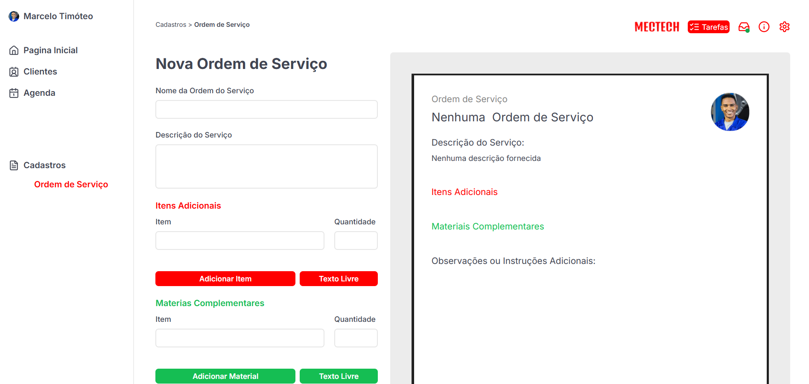

# 📌 MecTech - Sistema de Ordens de Serviço para Oficinas Mecânicas

## 🛠 Sobre o MecTech
O **MecTech** é um sistema para gestão de ordens de serviço em oficinas mecânicas. Ele permite que mecânicos e administradores organizem e documentem serviços realizados nos veículos de clientes, gerando um **PDF dinâmico** com os detalhes da ordem de serviço.



## 🚀 Funcionalidades Principais
- 📑 **Criação de Ordens de Serviço** com informações detalhadas.
- 🔍 **Visualização em Tempo Real** do documento gerado.
- 📄 **Geração de PDF Automática**, formatada profissionalmente.
- ✅ **Adição de Itens e Materiais Complementares**.
- 📝 **Campo de Observações e Instruções Adicionais**.
- 🎨 **Interface Intuitiva**.

## 🏗 Tecnologias Utilizadas
- **Frontend:** Next.js, TypeScript, TailwindCSS
- **Gerador de PDF:** `@react-pdf/renderer`
- **State Management:** React Hooks

## 🖥 Instalação e Uso
### 🔧 Pré-requisitos
Certifique-se de ter instalado:
- Node.js `>= 16.x`
- NPM ou Yarn

### 📥 Passos para Rodar o Projeto Localmente
1. **Clone o repositório:**
   ```bash
   git clone https://github.com/LuyandraBranco/MECTECH
   cd MECTECH
   ```
2. **Instale as dependências:**
   ```bash
   npm install  
   ```
3. **Inicie o servidor:**
   ```bash
   npm run dev  
   ```
4. Acesse **`http://localhost:3000`** no seu navegador.

## 📌 Estrutura do Projeto
```
/mectech
│── /app              # Páginas do Next.js
│── /components       # Componentes reutilizáveis
│── /assets           # Imagens
│── /public           # Imagens e arquivos estáticos
│── package.json      # Dependências e scripts do projeto
│── README.md         # Documentação do projeto
```

## 📬 Contato
Caso tenha dúvidas ou sugestões, sinta-se à vontade para contribuir ou entrar em contato!

---
📌 **MecTech** - Simplificando a Gestão de Oficinas Mecânicas 🚗🔧

## 👨‍💻 Autor

Este projeto foi desenvolvido por Luyandra Branco.